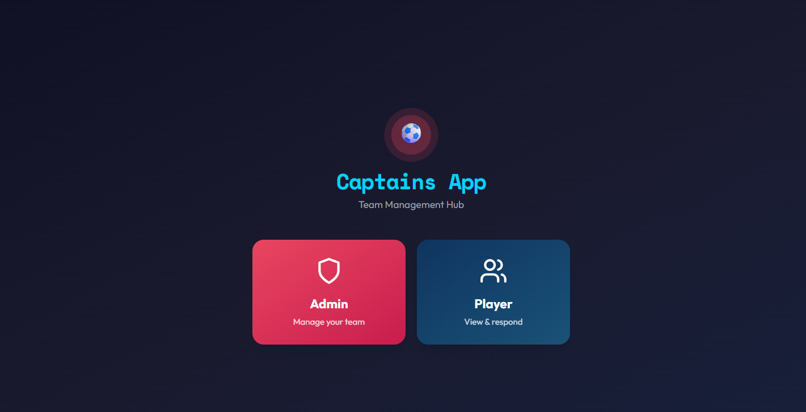
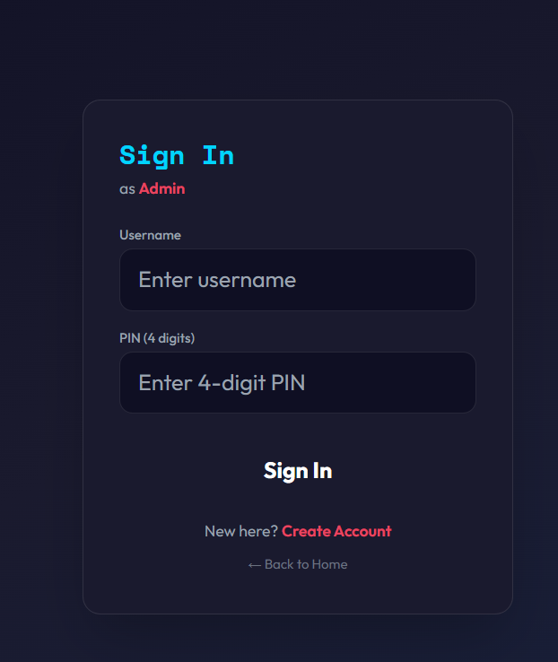
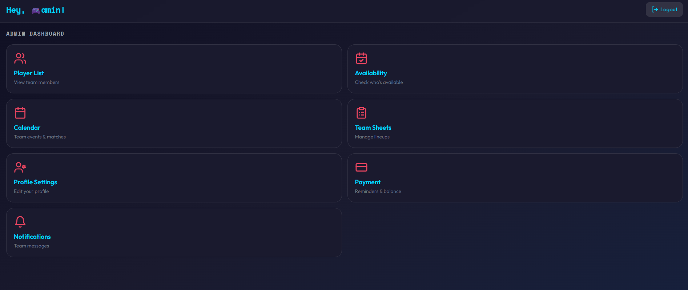
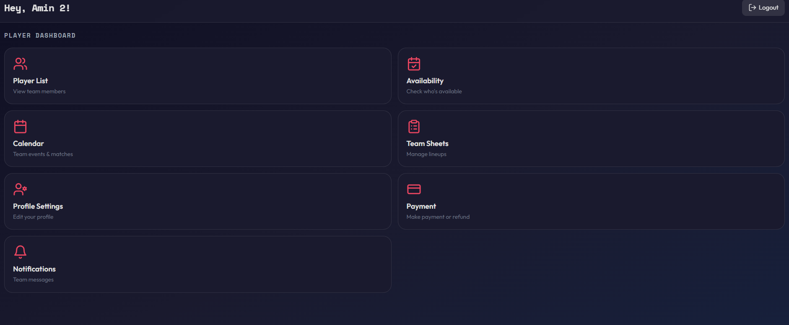

# Captain's App

Captain's App is a football team management web app designed to help captains organise their team in one place. The app helps manage players, availability, team sheets, payments, notifications, profiles, and communication.

## Screenshots

### Loading Screen

### Login Screen

### Admin Dashboard

### Player Dashboard

## Live Demo

View the live Canva version here:

https://captaintest.my.canva.site/captain

## Features

- Admin and player login roles
- Player list and player profiles
- Availability tracking
- Team sheet management
- Team notifications and messages
- Payment reminders
- Refund request option
- Profile settings
- Theme and font customisation
- Calendar and event planning

## Built With

- HTML
- CSS
- JavaScript
- Canva AI
- Prompt engineering

## Project Status

This is an early prototype created using Canva AI and prompt engineering. The current live version is hosted through Canva. The code has also been uploaded to GitHub for documentation and future development.

## Future Improvements

- Make the app work fully outside Canva
- Replace Canva SDK storage with localStorage or a database
- Add secure user authentication
- Add match result tracking
- Add squad statistics
- Improve mobile responsiveness
- Deploy as a standalone web app

## Author

Created by Ameenur Rahman Khan.
